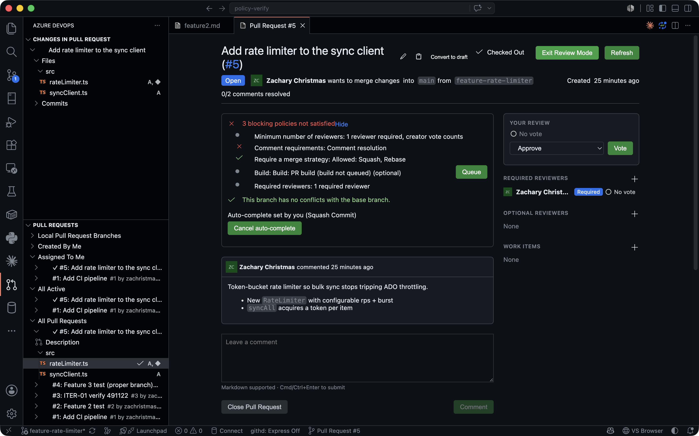
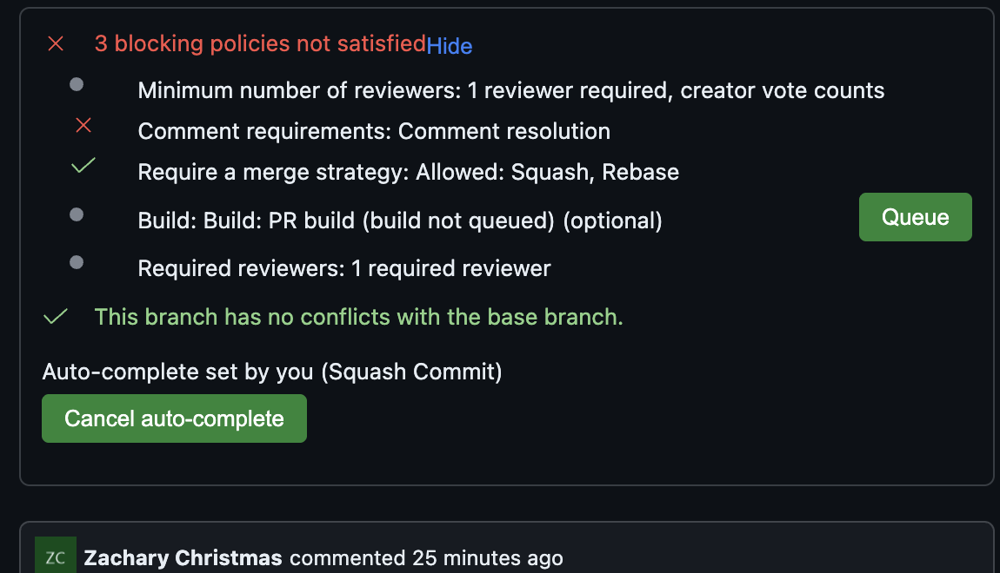
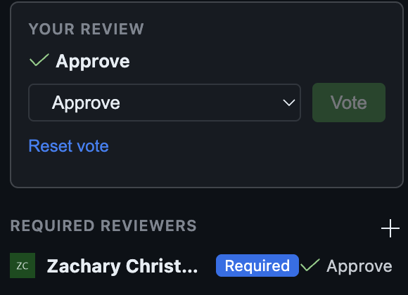
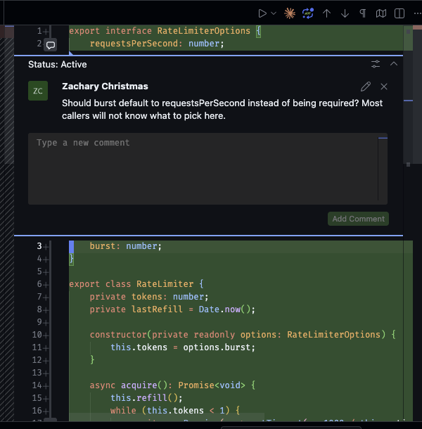
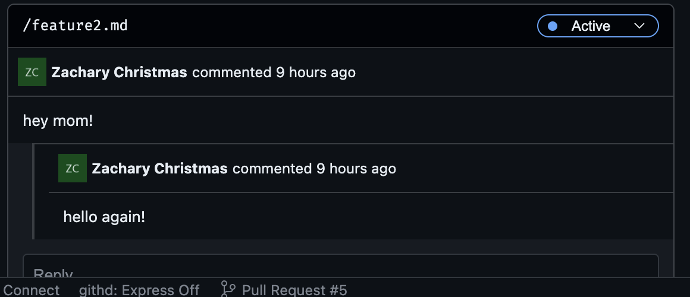
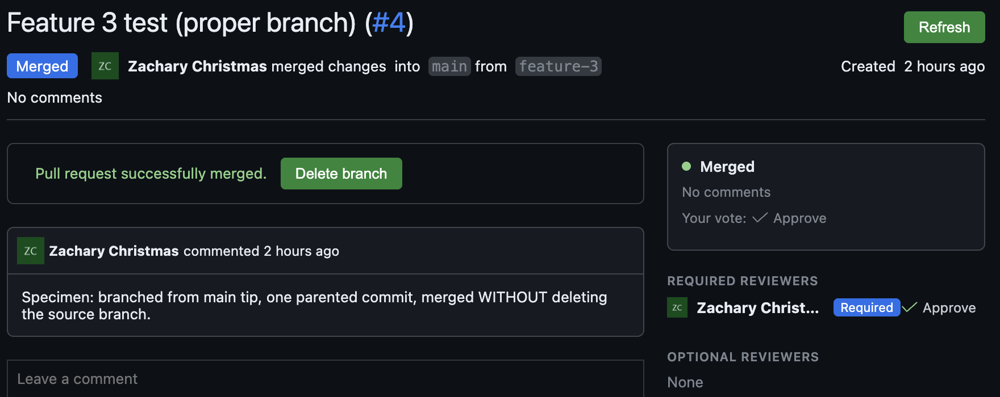
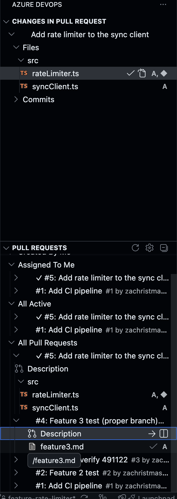
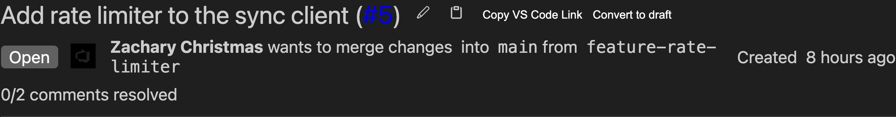

# Azure DevOps Pull Requests (Multi-Project)

Review, unblock, and complete Azure DevOps pull requests without leaving VS Code.

> **Maintained fork**: an actively maintained fork of [ankitbko/vscode-pull-request-azdo](https://github.com/ankitbko/vscode-pull-request-azdo), carrying the extension forward. All credit for the original goes to its author. Bug reports and feature requests: [zachristmas/vscode-pull-request-azdo/issues](https://github.com/zachristmas/vscode-pull-request-azdo/issues).

Works with git repositories on Azure DevOps Services (dev.azure.com). TFVC is not supported.

## What you can do

- Browse, check out, and review PRs from a tree view, including repositories from **multiple Azure DevOps projects** in one workspace
- Cast real ADO **reviewer votes** (Approve, Approve with suggestions, Wait for author, Reject) from the sidebar, the description page, or the command palette
- See exactly **which branch policies block completion**: minimum reviewers, comment resolution, required reviewers, work item linking, and build validation, with build click-through and re-queue
- **Set or cancel auto-complete** with merge strategy, merge commit message, delete-source-branch, and work item transition options; strategy choices respect the branch's "Limit merge types" policy
- Comment on code with **thread statuses** (Active, Resolved, Won't fix, Closed, Pending) that stay anchored to the right lines across new pushes
- **Create pull requests** and drafts from the current branch, with the target branch prefilled from the repository default
- Manage the whole lifecycle: publish drafts, convert back to draft, complete, and clean up branches afterward
- Link, view, and remove **work items** on a PR
- **Share a PR**: copy its web URL, a link to a file's diff, or a `vscode://` deep link that opens the PR (and a specific file and line) in a teammate's VS Code

## See why a PR can't complete

The description page shows every policy evaluation for the PR the way the ADO web UI does: what's approved, what's queued, what's rejected, and whether it blocks completion. Failing build validation links to the build and can be re-queued in place.

When policies are still pending, arm **auto-complete** instead of waiting around. The banner shows who armed it and with which options, and it can be cancelled in one click.

## Review with real votes

Azure DevOps reviews are votes, not GitHub-style approvals, and the extension treats them that way. The "Your review" card in the sidebar shows your current vote and casts a new one with live feedback; required and optional reviewers are listed separately with per-reviewer vote icons.

Votes are also available from the command palette (`AzDO PR: Approve`, `Approve with Suggestions`, `Wait for Author`, `Reject`, `Reset Vote`) and from the checked-out PR view in the activity bar.

## Comment threads that keep up

Review comments live where the code does: threads render inline in the diff editor at their tracked positions, with reply and status controls in place.

On the description page the same threads appear as cards headed by the file path and the anchoring line number, with a status pill (Active, Resolved, Won't fix, ...) that collapses the card once the thread is resolved. Each card shows a short excerpt of the commented code, so a thread is triageable without opening the file, and the file chip jumps straight to that line in the diff. Thread positions are tracked server-side, so a force-push or follow-up commit moves your comments with the code instead of leaving them stranded.

## A clear end state

Merged and abandoned PRs show a read-only outcome summary: final state, comment resolution, and your recorded vote. Editing affordances get out of the way, and the extension offers to delete the source branch (remote and local) after a merge.

## The PR list

Local branches with PRs, Created By Me, Assigned To Me, All Active, and All Pull Requests (for finding completed ones), across every repository in the workspace.

## Share a PR, or open one in VS Code

Copy a PR's web URL, a link straight to a file's diff, or a `vscode://` **deep link** that opens the PR in a teammate's VS Code. Every one of these is reachable from the PR list row, the description header, and the command palette.

Opening a deep link (`vscode://.../open-pr?...&path=/src/file.ts&line=42`) finds the workspace folder that clones the repo, opens the PR description page, and, when the link carries a file and line, jumps to that exact spot in the diff. "Take a look at this" now lands the reviewer on the right line instead of a repo URL.

## Getting started

1. VS Code 1.97 or newer.
2. Install the extension and reload.
3. Open a repository whose git remote points at Azure DevOps. Org and project are auto-detected from the remote (HTTPS, SSH, and legacy visualstudio.com URLs all work); the `azdoPullRequests.orgUrl` and `azdoPullRequests.projectName` settings exist as a fallback.
4. Sign in with the same Microsoft account you use for Azure DevOps, or set a PAT via `azdoPullRequests.patToken`.

## Settings

#### azdoPullRequests.orgUrl

- _type_: string
- _Description_: The organization URL, e.g. `https://dev.azure.com/<org_name>` or `https://<org_name>.visualstudio.com`. Only needed when auto-detection from the git remote fails.

#### azdoPullRequests.projectName

- _type_: string
- _Description_: The project name (the URL segment after the organization). Only needed when auto-detection fails.

#### azdoPullRequests.patToken

- _type_: string
- _Description_: A PAT from Azure DevOps. When provided the extension logs in with it instead of prompting for a Microsoft login.

#### azdoPullRequests.defaultMergeMethod

- _type_: enum (`merge`, `squash`, `rebase`, `rebaseMerge`)
- _default_: squash
- _Description_: Pre-selected merge strategy on the complete and auto-complete forms. Strategies disallowed by the branch's "Limit merge types" policy are disabled automatically.

#### azdoPullRequests.diffBase

- _type_: enum (`mergebase`, `head`)
- _default_: mergebase
- _Description_: The commit used to compute the diff against the PR's HEAD. See the [wiki](https://github.com/ankitbko/vscode-pull-request-azdo/wiki/Diff-Options-HEAD-vs-Merge-Base).

#### azdoPullRequests.logLevel

- _type_: enum
- _default_: Info
- _Description_: Log level for the AzDO Pull Request channel in the Output window.

## Version highlights

- **1.6.0**: deep links in both directions (copy a PR URL, a link to a file's diff, or a `vscode://` link; and open a PR from a `vscode://` link, jumping to a file and line); the create-pull-request flow rebuilt for Azure DevOps (Create Pull Request and Create Draft Pull Request); description-page thread chips carry the thread's line number and open the diff at that line. See the [CHANGELOG](CHANGELOG.md).
- **1.5.0**: branch policy evaluations with build click-through and re-queue; auto-complete with full completion options; policy-aware merge strategy choices; full reviewer vote spectrum with palette commands; comment threads tracked across pushes; draft publish and convert-to-draft; one description panel per PR; outcome summaries on finished PRs; theme-aware UI refresh; repaired completion, work item transition, and branch cleanup flows. See the [CHANGELOG](CHANGELOG.md).
- **1.1.0 to 1.3.0**: multi-project workspaces, authenticated avatars, SSH and visualstudio.com remote detection, paginated large-PR diffs, checkout by PR ID, viewed-state fixes, comment anchoring fixes.

## Known issues

None currently.

## Credits

Based on [ankitbko/vscode-pull-request-azdo](https://github.com/ankitbko/vscode-pull-request-azdo) by Ankit Sinha (see his [introductory blog post](https://ankitbko.github.io/blog/2021/01/azdo-pr-vscode-extension/)), which is itself derived from Microsoft's [GitHub Pull Requests](https://github.com/Microsoft/vscode-pull-request-github) extension. Not an official Microsoft product.
